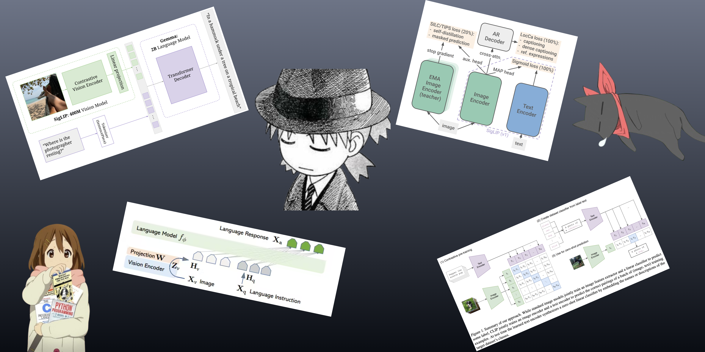

# vlm-fun

So I am planning on going all in on VLMs.  
In this repo, I'll be adding the code related to the stuff I'll be doing.

Also, you can check out my [Twitter](https://x.com/sodakeyEatsMush) where I post ML-related stuff.
