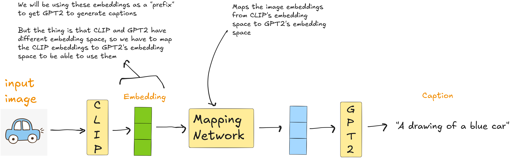

I recently tried implementing the [**ClipCap**](https://arxiv.org/pdf/2111.09734) model - an image captioning architecture that combines CLIP and GPT-2..

A lot of the code which I have written is inspired by the actual source code of [**ClipCap**](https://github.com/rmokady/CLIP_prefix_caption)

## How ClipCap Works

Here's a basic rundown of how the model operates:

1. **Input Image → CLIP Embeddings:**  
   The image is first encoded using CLIP, which converts it into a fixed-length embedding vector.

2. **Mismatch in Embedding Spaces:**  
   Since CLIP and GPT-2 operate in different embedding spaces, you can't directly feed the CLIP embeddings into GPT-2.

3. **Mapping Network (Prefix Mapping):**  
   A mapping network is used to transform the CLIP embeddings (called the *prefix*) into the GPT-2 embedding space.

4. **Caption Generation:**  
   The mapped embeddings are then fed into GPT-2, which generates a natural language caption based on the image.

## Sample Outputs

Here are some sample results from the model:

### 🖼️ Sample 1
  

---

### 🖼️ Sample 2
  

---

### 🖼️ Sample 3
  

---

### 🖼️ Sample 4
  

---

Note : These are examples where the model performed reasonably well. However, it's worth noting that it sometimes produced weird or completely off captions - especially when the image was complex or abstract.

---

## Training Details

- The CLIP model is **not** trained or fine-tuned - its image embeddings are good enough out of the box.
- There are **two variants** of the model based on whether or not GPT-2 is fine-tuned:

### 1. GPT-2 is Fine-Tuned
- **Mapping Network:** A Multi-Layer Perceptron (MLP)
- **Training:** Both the MLP and GPT-2 are trained

### 2. GPT-2 is Frozen
- **Mapping Network:** A Transformer
- **Training:** Only the transformer mapping network is trained

## Inference Methods

For inference, I implemented both:
- **Top-k Sampling**
- **Greedy Search**

## Model Weights

You can load the trained model weights from [**Hugging Face**](https://huggingface.co/saad1926q/clipcap-image-captioning)

The provided checkpoint (`coco_prefix_best_200k.pt`) was trained on **203,914 samples** from the **Conceptual Captions** dataset using **prefix tuning**.
